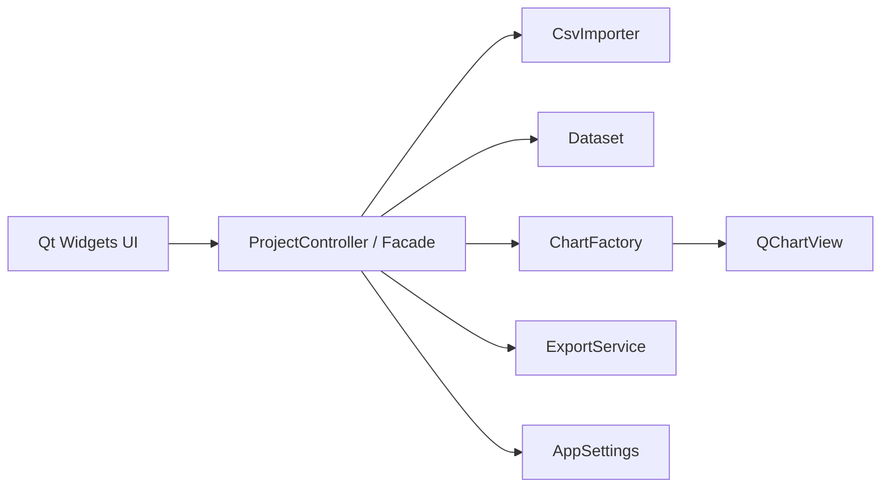
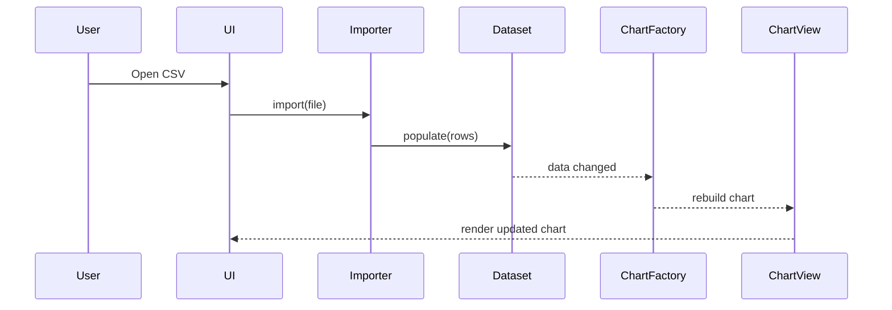
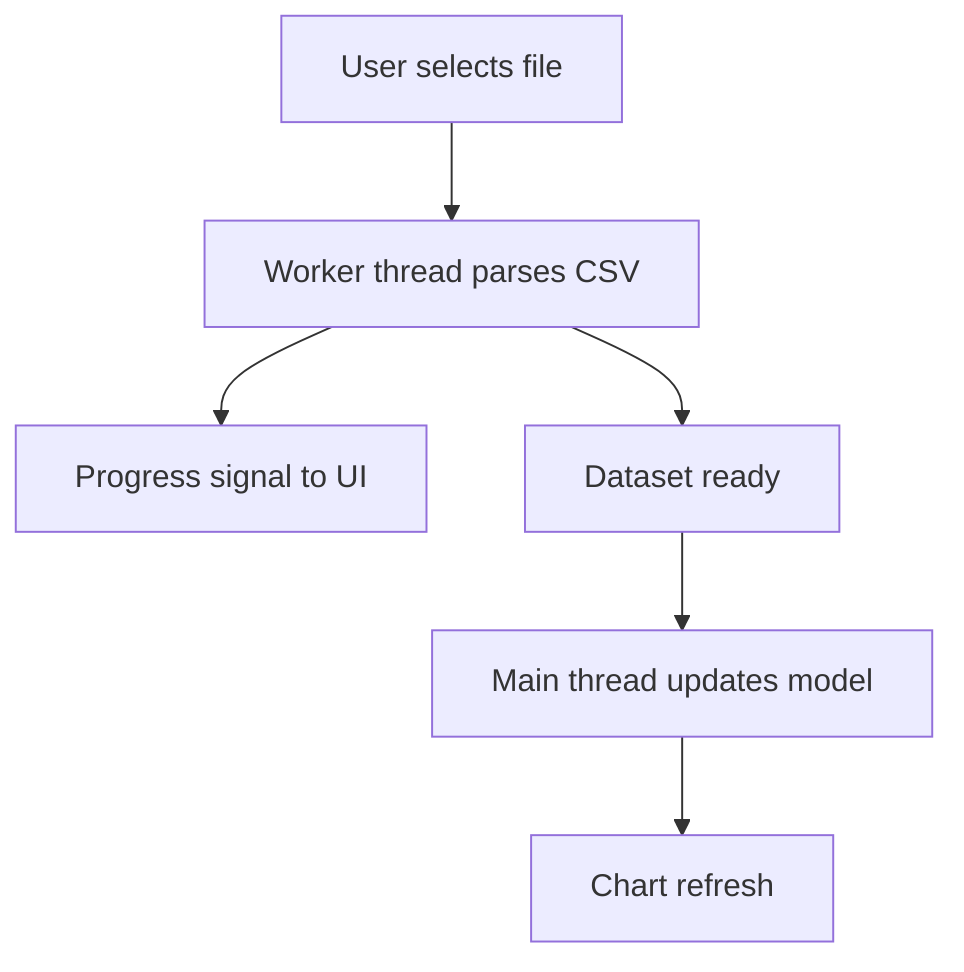

# Two-Month C++ and Qt Mentorship Roadmap

This repository now serves as a practical curriculum for learning modern C++ from scratch and using it to build a Linux desktop GUI application with Qt Widgets. You already have a useful Neovim-based setup, so the roadmap starts with what is ready now and then builds toward a CSV-driven charting application with testing, debugging, profiling, and packaging.

## 1. Environment Baseline

### What your current setup already gives you

From `~/.config/nvim` and installed binaries, you already have:

- Editor and language tooling: `clangd`, `cmake-language-server`, `nvim-lspconfig`
- Build tools: `cmake`, `ctest`, `g++`, `clang++`, `make`, `pkg-config`
- Debugging tools: `gdb`, `lldb`, `lldb-vscode-10`
- Neovim debug UI: `nvim-dap`, `nvim-dap-ui`
- C++ debug adapters: Mason-installed `OpenDebugAD7` (`cppdbg`) and `codelldb`
- CMake integration inside Neovim: `cmake-tools.nvim`

You do **not** currently have `ninja`, so the roadmap assumes standard CMake generators that work with `make`.

### Recommended workflow

- Edit with Neovim and `clangd`
- Build with `cmake -S . -B build` and `cmake --build build`
- Test with `ctest --test-dir build`
- Debug with either:
  - terminal `gdb ./build/app_name`
  - Neovim DAP using your configured `lldb` or `cppdbg`

### LazyVim and Qt setup checklist

1. Install Qt development packages for your distro.
2. Confirm `cmake --version`, `g++ --version`, and `pkg-config --version`.
3. Create a minimal Qt Widgets app with CMake.
4. Ensure `compile_commands.json` is generated so `clangd` sees the project:

```bash
cmake -S . -B build -DCMAKE_BUILD_TYPE=Debug -DCMAKE_EXPORT_COMPILE_COMMANDS=ON
ln -sf build/compile_commands.json .
```

5. Open the project in Neovim and confirm:
   - `clangd` attaches
   - `:LspInfo` shows the server
   - DAP can launch a compiled executable

## 2. Tutorial Roadmap

The roadmap uses **8 weeks** with **3 one-hour sessions per week**. Each tutorial has a goal, implementation target, and short coding challenge.

### Week 1: C++ basics and build model

#### Session 1: How C++ differs from Python
- Goal: understand compilation, headers, source files, and static typing.
- Topics: `main`, variables, types, `std::cout`, compiler errors, executable output.
- Build: write `hello.cpp` and compile with `g++ hello.cpp -o hello`.
- Challenge: print a formatted report about a CSV file you plan to analyze later.

#### Session 2: Control flow and functions
- Goal: write reusable logic.
- Topics: `if`, `switch`, loops, functions, return types, pass-by-value.
- Build: command-line statistics toy program.
- Challenge: write a function that counts values above a threshold.

#### Session 3: Strings, vectors, and files
- Goal: work with real input instead of hardcoded examples.
- Topics: `std::string`, `std::vector`, file streams, simple parsing.
- Build: read lines from a text file.
- Challenge: load a CSV file line-by-line and print the first 5 rows.

### Week 2: Memory, classes, and clean structure

#### Session 4: References, pointers, and RAII
- Goal: understand ownership and why C++ manages lifetime explicitly.
- Topics: stack vs heap, references, raw pointers, RAII, `std::unique_ptr`.
- Build: refactor a small program to avoid leaks.
- Challenge: compare a Python object reference to a C++ reference and pointer.

#### Session 5: Classes and encapsulation
- Goal: model data with types.
- Topics: classes, constructors, methods, `const`, private/public members.
- Build: `Dataset` class storing headers and rows.
- Challenge: add a method that returns column count safely.

#### Session 6: STL containers and algorithms
- Goal: write cleaner, faster code with the standard library.
- Topics: `std::map`, `std::unordered_map`, `std::sort`, lambdas.
- Build: frequency analysis for a CSV column.
- Challenge: sort rows by a numeric field.

### Week 3: CMake, testing, and debugging

#### Session 7: CMake from zero
- Goal: stop compiling by hand.
- Topics: `project`, `add_executable`, targets, include paths, build directories.
- Build: create a small multi-file CMake project.
- Challenge: split `Dataset` into header and source files.

#### Session 8: Google Test basics
- Goal: test behavior early.
- Topics: `TEST`, assertions, fixtures, arranging test data.
- Build: tests for CSV parsing and `Dataset`.
- Challenge: add a failing test for malformed rows, then fix the parser.

#### Session 9: Debugging with GDB and Neovim DAP
- Goal: inspect program state instead of guessing.
- Topics: breakpoints, stepping, watches, backtraces, launch configs.
- Build: debug a deliberate crash or bounds bug.
- Challenge: reproduce and fix an out-of-range access.

### Week 4: Project foundations and Qt Widgets

#### Session 10: Qt Widgets architecture
- Goal: learn the shape of a desktop app.
- Topics: event loop, `QApplication`, `QMainWindow`, widgets, layouts.
- Build: minimal Qt window.
- Challenge: add a toolbar and status bar.

#### Session 11: Signals and slots
- Goal: connect UI actions to program logic.
- Topics: Qt object model, events, signal-slot connections.
- Build: “Open CSV” action wired to a placeholder handler.
- Challenge: connect a button click to update a label with file metadata.

#### Session 12: Model-view thinking
- Goal: separate data from presentation.
- Topics: MVC/MV-inspired design, table widgets vs model/view.
- Build: display imported CSV rows in a table view.
- Challenge: show row and column counts in the UI.

### Week 5: Charting and exports

#### Session 13: Qt Charts and chart types
- Goal: render useful visuals.
- Topics: `QChart`, `QChartView`, bar, line, and pie charts.
- Build: render one chart from CSV data.
- Challenge: switch chart type based on user selection.

#### Session 14: Export to PNG and CSV
- Goal: turn the app into a tool, not a demo.
- Topics: rendering widgets to images, writing filtered/exported data.
- Build: PNG export and transformed CSV export.
- Challenge: export only selected columns.

#### Session 15: Themes and user customization
- Goal: support configurable presentation.
- Topics: palettes, chart styling, settings persistence.
- Build: light and dark chart themes or named color schemes.
- Challenge: persist the selected theme between runs.

### Week 6: Design patterns in the app

Apply each pattern only where it solves a real problem:

- `Singleton`: `AppSettings`
- `Factory`: `ChartFactory`
- `Strategy`: chart selection and optimization policies
- `Observer`: update charts when data changes
- `Decorator`: layer theme/style behavior onto charts
- `Command`: encapsulate export and import actions
- `Adapter`: normalize CSV sources or third-party chart APIs
- `Facade`: expose a simple `ProjectController` over subsystems
- `Builder`: construct charts or reports step by step
- `Model-View`: data model feeding the UI

#### Session 16: Factory, Strategy, Observer
- Build: chart creation pipeline with live updates from imported data.
- Challenge: add a new chart type without modifying the main window heavily.

#### Session 17: Singleton, Decorator, Command
- Build: shared settings, chart theme decorators, export commands.
- Challenge: implement undo for one user action conceptually with Command.

#### Session 18: Adapter, Facade, Builder, Model-View
- Build: simplify subsystem wiring and reduce UI coupling.
- Challenge: hide CSV import complexity behind one facade method.

### Week 7: Performance, concurrency, and robustness

#### Session 19: Profiling and benchmarks
- Goal: measure before optimizing.
- Topics: timing with `std::chrono`, benchmark harnesses, hot-path analysis.
- Build: benchmark CSV import for small vs large files.
- Challenge: compare `std::vector` growth with and without `reserve`.

#### Session 20: Large CSV optimization
- Goal: improve throughput and memory behavior.
- Topics: move semantics, avoiding copies, streaming parse design.
- Build: optimize parser and measure again.
- Challenge: record before/after timings in a table.

#### Session 21: Concurrency and responsiveness
- Goal: keep the UI responsive during import.
- Topics: threads, tasks, race conditions, Qt worker patterns, signaling results back.
- Build: background CSV import with progress updates.
- Challenge: disable chart controls until import completes safely.

### Week 8: Packaging, documentation, and final review

#### Session 22: Error handling and validation
- Goal: make the app reliable for real users.
- Topics: exceptions, result objects, validation rules, user-facing error messages.
- Build: graceful handling for empty files, malformed CSV, and invalid chart choices.
- Challenge: show clear feedback in both logs and UI dialogs.

#### Session 23: Linux packaging and deployment
- Goal: produce something installable.
- Topics: install targets, `CPack`, Debian package basics, runtime dependencies.
- Build: `.deb` packaging flow for a Qt Widgets app.
- Challenge: write the install and packaging section of `CMakeLists.txt`.

#### Session 24: Final review and extension paths
- Goal: consolidate everything.
- Topics: architecture review, testing gaps, debugging habits, maintainability, future features.
- Build: final retrospective and release checklist.
- Challenge: propose one extension, such as filtering, annotations, or extra chart types.

## 3. Learning Resources

### Core C++
- LearnCpp: https://www.learncpp.com/
- cppreference: https://en.cppreference.com/
- Google C++ Style Guide: https://google.github.io/styleguide/cppguide.html

### Build and testing
- CMake tutorial: https://cmake.org/cmake/help/latest/guide/tutorial/
- GoogleTest docs: https://google.github.io/googletest/

### Qt and charting
- Qt Widgets docs: https://doc.qt.io/
- Qt Charts overview: https://doc.qt.io/qt-6/qtcharts-index.html
- Model/View programming: https://doc.qt.io/qt-6/model-view-programming.html

### Debugging and performance
- GDB docs: https://www.gnu.org/software/gdb/documentation/
- perf wiki: https://perf.wiki.kernel.org/
- Valgrind docs: https://valgrind.org/docs/manual/

### Packaging
- CPack docs: https://cmake.org/cmake/help/latest/module/CPack.html
- Debian packaging guide: https://www.debian.org/doc/manuals/maint-guide/

## 4. Project Guidance

Build the final project in milestones:

1. Console CSV parser with tests
2. CMake-based library and executable split
3. Qt Widgets shell application
4. CSV table display
5. Chart rendering with multiple chart types
6. Export to PNG and CSV
7. Settings, themes, and design patterns
8. Background import and benchmarks
9. Packaging and end-user help/documentation

Recommended project structure once you start implementation:

```text
src/
  app/
  csv/
  charts/
  export/
  settings/
  ui/
include/
tests/
assets/
docs/
```

Suggested core interfaces:

```cpp
class CsvImporter;
class Dataset;
class ChartFactory;
class ExportService;
class AppSettings;
```

## 5. Coding Challenges by Theme

Reuse these challenge ideas across the roadmap:

- parse a CSV into structured rows
- validate numeric vs text columns
- implement a strategy for line/bar/pie chart selection
- add a factory for chart creation
- benchmark import of 1K, 10K, and 100K rows
- write Google Tests for malformed input
- debug a segmentation fault caused by invalid indexing
- move CSV import to a worker thread
- export the visible chart as PNG

## 6. UML and Architecture Diagrams

### High-level application structure



### Observer-style chart refresh flow



### Background import workflow



## 7. Testing and Debugging Strategy

### Testing priorities
- unit-test CSV parsing rules
- unit-test chart selection logic
- unit-test settings and export code
- add smoke tests for major GUI flows
- keep heavy UI logic thin and move logic into testable classes

### Must-cover scenarios
- empty file
- malformed delimiter counts
- missing headers
- non-numeric values in numeric chart mode
- huge file import
- export path failure
- user cancellation during import

### Debugging workflow
1. Build a debug configuration:

```bash
cmake -S . -B build -DCMAKE_BUILD_TYPE=Debug -DCMAKE_EXPORT_COMPILE_COMMANDS=ON
cmake --build build
```

2. Debug in terminal:

```bash
gdb ./build/your_app
```

3. Debug in Neovim:
   - set a breakpoint
   - press `<F5>` to launch
   - use `<F7>` to step into
   - use `<F8>` to step over
   - inspect variables in DAP UI

4. Profile before optimizing:
   - measure import durations
   - compare before/after optimization passes
   - record data sizes and timings

## 8. Deployment Guidance

For Linux deployment, prefer a CMake-driven flow:

1. add `install(TARGETS ...)`
2. install icons, desktop files, and help assets
3. enable `include(CPack)`
4. configure Debian package metadata
5. test install locally before packaging

Typical release checklist:

- all tests pass with `ctest --test-dir build`
- app launches on a clean user session
- import/export features work
- help/documentation menu is populated
- package installs and uninstalls cleanly

## 9. Final Review

By the end of this roadmap, you should be able to:

- read and write modern C++ comfortably
- use CMake, Google Test, GDB, and Neovim DAP productively
- explain RAII, ownership, STL use, and clean code principles
- build a Qt Widgets desktop app on Linux
- parse and visualize CSV data with multiple chart types
- apply 10 design patterns in practical, non-forced ways
- profile, optimize, and parallelize slow data-processing paths
- package the app for Debian-based Linux

Best extension ideas after the core project:

- filtering and aggregation
- annotations on charts
- plugin-style chart backends
- user profiles and saved workspaces
- richer import formats such as TSV or JSON
